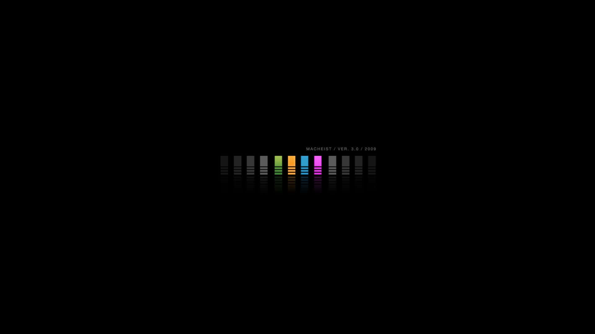

  

<h1 align="center">Pritam Suryawanshi (Pegasus) 🦇</h1>

Full-Stack Developer • Machine Learning • Cloud • Data Science

  

## 🖤 About Me  
A developer who builds with a mix of  
**discipline, curiosity, and silent main-character energy.**

- MSc Data Science @ Fergusson  
- Working on ML + XGBoost + Streamlit systems  
- Love clean code, clean UI, clean architecture  
- Building towards a tech startup future  
- Big believer in “learn fast, ship faster”

---

## 🎯 Tech Stack  

  

---

## 📊 GitHub Snapshot  
*(Self-hosted: add your own screenshots into assets/)*

    
    
  

---

## 🚀 Featured Work  
- **Machinelearning_Projects** → ML pipelines, EDA, model training  
- **Projects** → Full-stack experiments & utilities  

---

## 🔧 What I'm Building Right Now  

ML systems with XGBoost
Streamlit dashboards
Smart Parking ML architecture
Cloud-ready backend designs

---

## 🦇 Connect With Me  
**Email:** pritamsuryawanshi278@gmail.com  
**GitHub:** https://github.com/Pegasis00  

---

  

